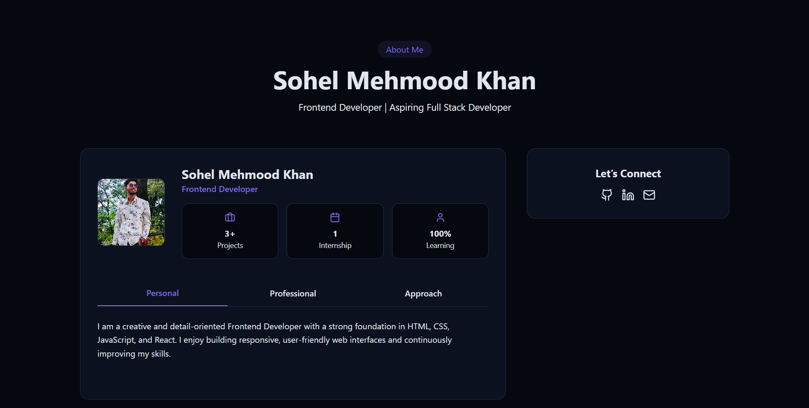
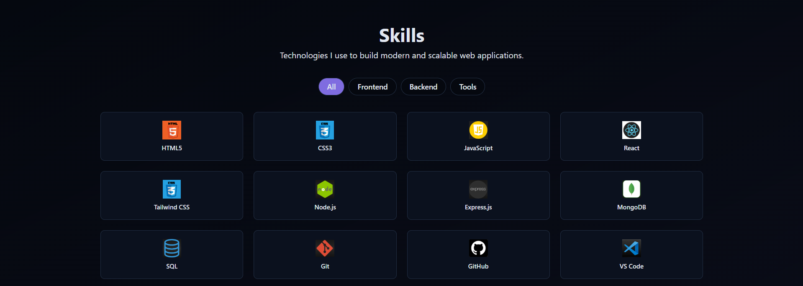
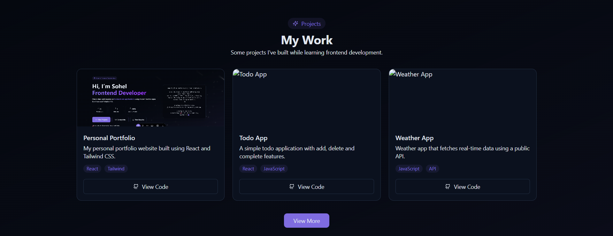
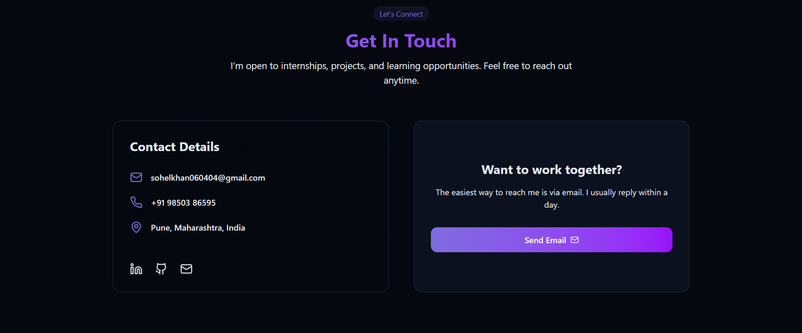

# 💼 Developer Portfolio – React + Vite + Tailwind

A fast, modern, and responsive developer portfolio website built using **React**, **Vite**, and **Tailwind CSS**. Designed to showcase projects, skills, and contact information in a clean, professional format.

## 🚀 Tech Stack

- ⚛️ React (with Vite for fast dev/build)
- 💨 Tailwind CSS (utility-first styling)
- 🔧 JavaScript (ES6+)
- 💡 Optional: Framer Motion for animations

## 📸 Screenshots

### 🏠 Home Page  

### 🧰 other section  

## ✨ Features

- Responsive and mobile-friendly design
- Easy customization of content and sections
- Project and skill sections configured via simple data files
- Smooth navigation and clean layout
- Deployed and optimized using Vite

